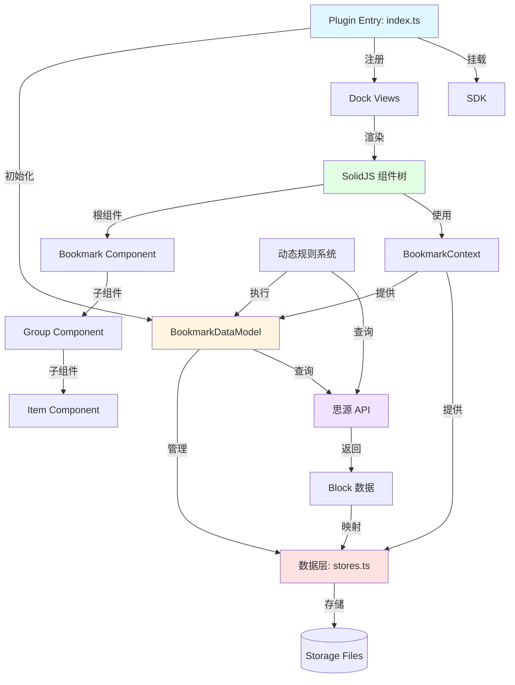
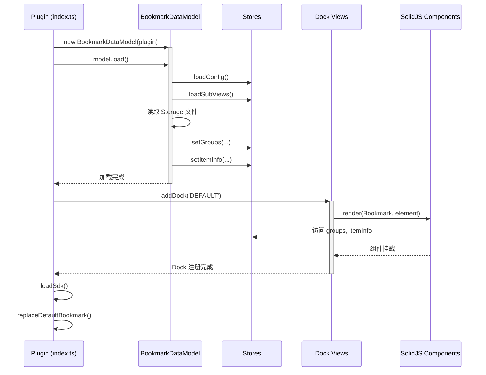
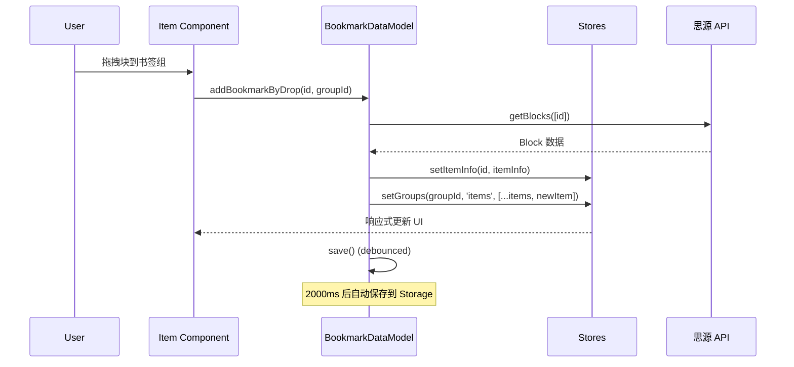
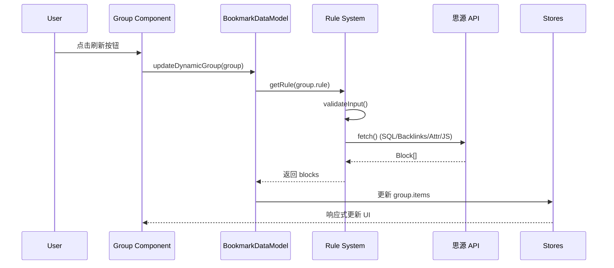

# 整体架构

## 概述

sy-bookmark-plus 是一个思源笔记插件，用于增强书签功能。插件基于 **SolidJS** 框架开发，使用 TypeScript，并集成了自定义库 `@frostime/solid-signal-ref` 用于状态管理。

**核心功能**：
- 书签组管理（静态 + 动态）
- 拖拽添加书签项
- 动态查询（SQL、Backlinks、属性、JavaScript）
- 多视图支持（默认视图 + 自定义子视图）
- 与思源笔记深度集成

**技术栈**：
- **前端框架**：SolidJS (^1.8.17)
- **语言**：TypeScript (^5.4.2)
- **构建工具**：Vite (^5.2.13)
- **状态管理**：solid-js/store + @frostime/solid-signal-ref (^2.2.0)
- **API 集成**：思源插件 API (siyuan 1.1.7)
- **工具库**：@frostime/siyuan-plugin-kits (^1.6.0)

---

## 整体架构图



---

## 核心模块关系

### 1. 插件入口层 (`src/index.ts`)

**职责**：
- 插件生命周期管理（`onload`, `onunload`, `openSetting`）
- Dock 视图注册
- 配置加载与保存
- 替换思源默认书签功能（可选）
- SDK 挂载

**关键类**：`PluginBookmarkPlus extends Plugin`

**生命周期钩子**：
```typescript
onload()  → 加载配置 → 初始化 Model → 注册 Dock → 挂载 SDK
onunload() → 卸载 SDK → 销毁 Model → 销毁所有视图 → 恢复默认书签
openSetting() → 打开设置面板
```

**与其他模块的关系**：
- 创建并持有 `BookmarkDataModel` 实例
- 调用 `dock-views.ts` 中的 `initBookmark` 初始化视图
- 调用 `sdk.ts` 中的 `loadSdk()` 和 `unloadSdk()` 管理全局 SDK

---

### 2. 数据模型层 (`src/model/`)

**职责**：
- 管理书签数据（书签组、书签项）
- 数据持久化（debounce 保存）
- 动态规则执行
- 与思源 API 交互

**核心文件**：
- `index.ts` - `BookmarkDataModel` 类，核心业务逻辑
- `stores.ts` - SolidJS Store 定义（`itemInfo`, `groups`, `subViews`, `configs`）
- `data.ts` - 思源 API 封装（`getBlocks`, `getDocInfos`）
- `rules.ts` - 动态规则实现（SQL、Backlinks、Attr、JS）
- `templating.ts` - 变量模板系统（`{{CurDocId}}` 等）
- `utils.ts` - 工具函数

**关键设计**：
- **引用计数**：`itemInfo` 中的 `ref` 字段追踪书签项被引用次数
- **Debounce 保存**：使用 2000ms debounce 避免频繁写入
- **Store 响应式**：利用 SolidJS Store 自动触发 UI 更新

---

### 3. 视图层 (`src/components/`)

**职责**：
- 渲染 UI 组件
- 处理用户交互（拖拽、点击、右键菜单）
- 响应式更新

**核心文件**：
- `bookmark.tsx` - 根组件，管理整体视图
- `group.tsx` - 书签组组件
- `item.tsx` - 书签项组件
- `new-group.tsx` - 创建新书签组对话框
- `context.ts` - `BookmarkContext` 定义
- `setting/` - 设置面板组件
- `elements/` - 通用 UI 元素（图标选择器等）

**组件层级**：
```
Bookmark (根)
  └─ For<Group>
       ├─ Group Header（标题、展开/折叠）
       └─ For<Item>
            └─ Item（图标、标题、悬停预览）
```

**数据流**：
```
Context Provider → Bookmark → Group → Item
                   ↓          ↓       ↓
                 Model      Store   ItemInfo
```

---

### 4. Dock 视图系统 (`src/dock-views.ts`)

**职责**：
- 注册 Dock 视图到思源
- 管理视图的创建和销毁
- 视图 Disposer 模式

**关键机制**：
- **Disposer 模式**：使用 `disposers` 对象追踪每个视图的 dispose 函数
- **多视图支持**：默认视图（DEFAULT）+ 自定义子视图（Sub Views）
- **懒加载更新**：视图首次渲染时触发 `lazyUpdateModel.update()`

**视图类型**：
- `DEFAULT` - 默认书签视图
- `TBookmarkSubViewId` - 用户自定义子视图

---

### 5. 工具库层 (`src/libs/`, `src/utils/`)

**libs/**：
- `dialog.ts` - SolidJS 对话框封装
- `dom.ts` - DOM 操作工具
- `op.ts` - 书签项操作（移动、插入、删除）
- `query.ts` - 查询工具
- `components/` - 通用 UI 组件库（表单、输入框、按钮等）

**utils/**：
- `const.ts` - 常量定义（SVG 图标等）
- `i18n.ts` - 国际化
- `style.ts` - 动态样式注入
- `index.ts` - 通用工具函数

---

### 6. 类型定义 (`src/types/`)

**核心类型**：
- `bookmark.d.ts` - 书签相关类型
  - `IBookmarkGroup` - 书签组
  - `IBookmarkItem` - 书签项
  - `IBookmarkItemInfo` - 书签项 UI 信息
  - `IBookmarkSubView` - 子视图
  - `IDynamicRule` - 动态规则
- `setting.d.ts` - 设置相关类型
- `i18n.d.ts` - 国际化类型
- `api.d.ts` - 思源 API 类型
- `index.d.ts` - 通用类型

---

## 数据流

### 启动流程



### 用户交互流程（添加书签项）



### 动态规则执行流程



---

## 插件生命周期

### onload() 阶段

1. **注册插件**：`registerPlugin(this)` - 将插件实例注册到全局
2. **设置国际化**：`setI18n(this.i18n)`
3. **添加图标**：`this.addIcons(...)`
4. **创建 Model**：`model = getModel(this)`
5. **加载数据**：`await model.load()`
   - 从 Storage 读取 bookmarks、configs、sub-views、item-snapshot
   - 初始化 Stores（`groups`, `itemInfo`, `configs`, `subViews`）
6. **替换默认书签**（可选）：
   - 隐藏思源默认书签按钮
   - 绑定快捷键到自定义书签视图
7. **注册 Dock 视图**：
   - 默认视图（DEFAULT）
   - 所有未隐藏的 Sub Views
8. **挂载 SDK**：`loadSdk()` - 挂载 `window.BookmarkPlusSDK`
9. **启用自动刷新**（可选）：监听文档切换事件

### onunload() 阶段

1. **卸载 SDK**：`unloadSdk()`
2. **移除 Model**：`rmModel()`
3. **销毁所有视图**：`destroyAllBookmark()`
   - 调用所有 disposers
   - 移除 Dock 图标
   - 清理 DOM
4. **恢复默认书签**：`bookmarkKeymap.restoreDefault()`
   - 恢复快捷键
   - 显示思源默认书签

### openSetting() 阶段

1. **打开设置对话框**：`solidDialog(...)`
   - 使用 SolidJS 渲染设置面板
   - 提供书签组管理、视图管理、配置选项
2. **保存配置**：对话框关闭时自动保存

---

## 数据持久化

### Storage 文件

| 文件名 | 内容 | 保存时机 |
|--------|------|----------|
| `bookmarks.json` | 所有书签组数据 | debounce 2000ms |
| `bookmark-configs.json` | 插件配置 | debounce 750ms |
| `bookmark-sub-views.json` | 子视图定义 | debounce 1000ms |
| `bookmark-items-snapshot.json` | 书签项快照（区分笔记本关闭 vs 块删除） | debounce 2000ms |

### Debounce 策略

- **目的**：避免频繁写入磁盘
- **实现**：使用 `@frostime/siyuan-plugin-kits` 的 `debounce` 工具
- **时长**：
  - `saveGroupMap`: 1000ms（后又改为 2000ms）
  - `saveConfig`: 750ms
  - `saveSubViews`: 1000ms

### 数据一致性

- **引用计数**：`itemInfo[id].ref` 追踪引用次数，防止误删
- **快照机制**：保存上次成功加载的 Block 信息，用于区分笔记本关闭和块删除
  - **问题**：思源的笔记本可以被关闭，关闭后块未被索引，查询会返回 null
  - **误判风险**：插件可能误以为块被删除，实际只是笔记本关闭
  - **快照作用**：保存完整的 Block 信息（title、type、box 等），当查询失败时：
    - 如果 `box`（笔记本）处于关闭状态 → 标记为 `BoxClosed`（临时不可访问）
    - 如果 `box` 打开但查不到块 → 标记为 `BlockDeleted`（永久删除）
  - **用户体验**：笔记本关闭时书签项仍显示标题（来自快照），而非消失
- **动态组优化**：动态组只保存自定义样式的 item，其他 item 由规则重新生成

---

## 关键设计决策

### 1. 为何使用 SolidJS？

- **细粒度响应式**：只更新变化的 DOM 节点，性能优越
- **轻量级**：体积小，适合插件环境
- **TypeScript 友好**：完整的类型支持

### 2. 为何使用 solid-signal-ref？

- **简化 Store 操作**：提供 `unwrap()`, `update()` 等便捷方法
- **类型安全**：强化 TypeScript 推导
- **作者自研**：针对项目需求定制

### 3. 为何采用 Disposer 模式？

- **内存管理**：SolidJS 组件需手动 dispose 以释放资源
- **多视图支持**：每个视图独立管理生命周期
- **动态创建/销毁**：用户可动态添加/删除子视图

### 4. 为何使用 Debounce 保存？

- **性能优化**：拖拽操作频繁，避免每次操作都写文件
- **数据合并**：批量更新一次性写入
- **思源 API 限制**：减少对思源后端的压力

---

## 扩展性

### 添加新的动态规则类型

1. 在 `src/model/rules.ts` 中实现新的 `Rule` 类
2. 在 `getRule()` 中注册
3. 在 `src/components/new-group.tsx` 中添加 UI 选项

### 添加新的 Dock 视图

1. 在设置面板中创建新的 Sub View
2. 重启思源后自动注册为新的 Dock 视图

### 添加新的存储字段

1. 在 `src/types/bookmark.d.ts` 中扩展类型
2. 在 `src/model/stores.ts` 中添加 Store 字段
3. 在 `BookmarkDataModel.load()` 和 `save()` 中处理

---

## 相关文档

- [SolidJS 组件系统](./solidjs-components.md) - 组件层级、Context、状态管理
- [数据模型与存储](./data-model.md) - 数据结构、Store、思源 API 集成
- [Dock 视图系统](./dock-views.md) - Dock 注册、多视图、Disposer 模式
