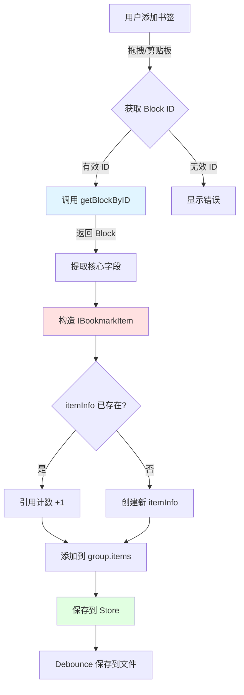

# 数据模型与存储

## 概述

本文档描述 sy-bookmark-plus 的核心数据模型、状态管理机制、数据持久化策略，以及如何与思源笔记 API 集成，将思源的 Block 数据映射到书签的数据模型中。

**核心内容**：
- 数据结构设计（`IBookmarkGroup`、`IBookmarkItem`、`IBookmarkSubView`）
- SolidJS Store 管理（`itemInfo`、`groups`、`subViews`、`configs`）
- BookmarkDataModel 类的职责
- 数据持久化策略（Storage 文件、debounce 保存）
- 思源 API 调用封装
- Block 数据 → 书签数据的映射流程

---

## 核心数据结构

### 类型定义

**文件**：`src/types/bookmark.d.ts`

#### 1. IBookmarkGroup - 书签组

```typescript
interface IBookmarkGroup {
    id: TBookmarkGroupId;          // 唯一标识
    name: string;                  // 显示名称
    expand?: boolean;              // 展开/折叠状态（默认 true）
    hidden?: boolean;              // 是否在列表中隐藏
    items: IItemCore[];            // 书签项列表
    type?: TBookmarkGroupType;     // 'normal' | 'dynamic' | 'composed'
    rule?: IDynamicRule;           // 动态规则配置
    icon?: {                       // 图标配置
        type: 'symbol' | 'emoji' | '';
        value: string;
    }
}

type TBookmarkGroupType = 'normal' | 'dynamic' | 'composed';
```

**设计要点**：
- **id**：使用时间戳或 UUID 生成，全局唯一
- **type**：
  - `normal` - 静态组，用户手动添加项
  - `dynamic` - 动态组，通过规则自动更新
  - `composed` - 组合组（未来扩展）
- **items**：只存储 `id` 和 `style`，详细信息在 `itemInfo` 中

#### 2. IItemCore - 书签项核心数据

```typescript
interface IItemCore {
    id: BlockId;      // 思源块 ID
    style?: string;   // 自定义 CSS 样式（如颜色标记）
}
```

**设计要点**：
- **轻量化**：`items` 数组只存储必要信息
- **style**：用户自定义样式（高亮颜色等），动态组只保存有 style 的项

#### 3. IBookmarkItemInfo - 书签项完整信息

```typescript
interface IBookmarkItemInfo extends IBookmarkItem {
    icon: string;                     // 图标（文档图标、块类型图标）
    ref: number;                      // 引用计数
    err?: 'BoxClosed' | 'BlockDeleted';  // 错误状态
}

interface IBookmarkItem {
    id: BlockId;
    title: string;         // 块标题或内容
    type: BlockType;       // 思源块类型（'d', 'p', 'h', ...）
    box: NotebookId;       // 所属笔记本
    subtype: BlockSubType | '';  // 子类型
}
```

**设计要点**：
- **ref 引用计数**：一个块可能在多个书签组中，`ref` 记录被引用次数
- **err 错误状态**：
  - `BoxClosed` - 笔记本已关闭（暂时不可访问）
  - `BlockDeleted` - 块已删除（永久不可访问）
- **icon**：根据 type 和文档设置动态生成

#### 4. IBookmarkSubView - 子视图

```typescript
interface IBookmarkSubView {
    id: TBookmarkSubViewId;        // 视图 ID
    name: string;                  // 显示名称
    hidden?: boolean;              // 是否隐藏（不注册 Dock）
    icon?: {                       // Dock 图标
        type: 'symbol' | 'emoji' | '';
        value: string;
    };
    groups: TBookmarkGroupId[];    // 包含的书签组 ID 列表
    expand: Record<TBookmarkGroupId, boolean>;  // 每个组的展开状态
    dockPosition?: 'RightTop' | 'RightBottom' | 'LeftTop' | 'LeftBottom';
}
```

**设计要点**：
- **groups**：视图包含的书签组 ID 列表（而非完整对象，避免冗余）
- **expand**：视图级别的展开状态，覆盖 `group.expand`

#### 5. IDynamicRule - 动态规则

```typescript
type TRuleType = 'sql' | 'backlinks' | 'attr' | 'js';

interface IDynamicRule {
    type: TRuleType;
    input: string;   // 规则输入（SQL 语句、块 ID、属性名、JS 代码）
}
```

---

## Store 管理机制

### Store 定义

**文件**：`src/model/stores.ts`

```typescript
// 1. 书签项信息字典
export const [itemInfo, setItemInfo] = createStore<{
    [key: BlockId]: IBookmarkItemInfo
}>({});

// 2. 书签组列表
export const [groups, setGroups] = createStore<IBookmarkGroup[]>([]);

// 3. 书签组映射表（计算属性）
export const groupMap = createMemo<Map<TBookmarkGroupId, IBookmarkGroup & {index: number}>>(() => {
    return new Map(groups.map((group, index) => [group.id, {...group, index}]));
});

// 4. 子视图配置（使用 solidjs-signal-ref）
export const subViews = createStoreRef<{
    [key: TBookmarkSubViewId]: IBookmarkSubView
}>({});

// 5. 插件配置
export const [configs, setConfigs] = createStore<IConfig>({
    hideClosed: true,
    hideDeleted: true,
    viewMode: 'bookmark',
    replaceDefault: true,
    autoRefreshOnExpand: false,
    ariaLabel: false,
    zoomInWhenClick: true,
    autoRefreshTemplatingRuleOnSwitchProtyle: false
});

// 包装为 StoreRef（提供 .unwrap() 和 .update() 方法）
export const configRef = wrapStoreRef(configs, setConfigs);
```

### Store 职责分工

| Store | 职责 | 访问模式 |
|-------|------|---------|
| `itemInfo` | 管理所有书签项的详细信息 | `itemInfo[blockId]` |
| `groups` | 管理书签组列表（顺序、配置） | `groups[index]` 或 `groups.find(...)` |
| `groupMap` | 提供快速的 ID → Group 查找 | `groupMap().get(groupId)` |
| `subViews` | 管理自定义子视图配置 | `subViews()[viewId]` |
| `configs` | 管理插件全局配置 | `configs.viewMode` |

### 引用计数机制

**问题**：一个块可能在多个书签组中，如何管理？

**方案**：使用 `ref` 字段记录引用次数

```typescript
// 添加书签项
if (itemInfo[id]) {
    // 已存在，引用计数 +1
    setItemInfo(id, 'ref', (ref) => ref + 1);
} else {
    // 新增，初始化 ref = 1
    setItemInfo(id, {
        id, title, type, box, subtype, icon: '', ref: 1
    });
}

// 删除书签项
if (itemInfo[id].ref === 1) {
    // 最后一个引用，删除整个条目
    setItemInfo(id, undefined!);
} else {
    // 还有其他引用，引用计数 -1
    setItemInfo(id, 'ref', (ref) => ref - 1);
}
```

**好处**：
- 避免重复存储相同块的信息
- 自动管理内存，无引用时自动删除

---

## BookmarkDataModel 类

### 类定义

**文件**：`src/model/index.ts`

```typescript
export class BookmarkDataModel {
    plugin: PluginBookmarkPlus;

    constructor(plugin: PluginBookmarkPlus) {
        this.plugin = plugin;
    }

    // 核心方法
    async load();                          // 加载所有数据
    save(fpath?: string);                  // 保存数据（debounced）

    // 书签组操作
    newGroup(...);                         // 创建新书签组
    delGroup(id);                          // 删除书签组
    moveGroup(from, to);                   // 移动书签组
    setGroups(gid, key, value);            // 更新书签组属性

    // 书签项操作
    addItem(groupId, item);                // 添加书签项
    delItem(groupId, itemId);              // 删除书签项
    moveItem(detail);                      // 移动书签项
    hasItem(id, groupId?);                 // 检查书签项是否存在
    listItems(groupId);                    // 列出书签组内所有项

    // 动态组操作
    async updateViews(viewId?);            // 更新视图（刷新动态组）
    async updateDynamicGroup(group);       // 更新单个动态组

    // 静态项更新
    async updateStaticItems(idsSet);       // 更新静态项信息
    updateGroupStaticItemsDebounced(...);  // debounced 版本
}
```

### 关键方法详解

#### 1. load() - 数据加载

```typescript
async load() {
    // 1. 加载书签组
    let bookmarks = await this.plugin.loadData('bookmarks.json');

    // 2. 加载配置
    await loadConfig();
    await loadSubViews();

    // 3. 加载快照（防止笔记本关闭时误删）
    let snapshot = await this.plugin.loadData('bookmark-items-snapshot.json');

    // 4. 初始化 Store
    for (let [_, group] of Object.entries(bookmarks)) {
        // 转换为 V2 格式（items 只存 IItemCore）
        let items = group.items.map(item => ({id: item.id, style: item?.style}));

        // 添加到 groups Store
        setGroups((gs) => [...gs, {...group, items}]);

        // 初始化 itemInfo（优先使用 snapshot）
        group.items.forEach(item => {
            if (!itemInfo[item.id]) {
                setItemInfo(item.id, {
                    id: item.id,
                    title: snapshot[item.id]?.title ?? '',
                    type: snapshot[item.id]?.type ?? 'p',
                    box: snapshot[item.id]?.box ?? '',
                    subtype: snapshot[item.id]?.subtype ?? '',
                    icon: snapshot[item.id]?.icon ?? '',
                    ref: 1
                });
            } else {
                // 已存在，引用计数 +1
                setItemInfo(item.id, 'ref', (ref) => ref + 1);
            }
        });
    }
}
```

#### 2. save() - 数据保存

```typescript
private async saveCore(fpath?: string) {
    // 1. 保存书签组
    await saveGroupMap(fpath);  // → bookmarks.json

    // 2. 保存子视图
    await saveSubViews();       // → bookmark-sub-views.json

    // 3. 保存快照
    await this.plugin.saveData('bookmark-items-snapshot.json', itemInfo);
}

// Debounced 版本（2000ms）
save = debounce(this.saveCore.bind(this), 2000);
```

**快照机制**：
- 保存 `itemInfo` 的完整副本
- 下次启动时，即使笔记本关闭，也能显示标题
- 避免用户误以为书签项被删除

#### 3. updateDynamicGroup() - 更新动态组

```typescript
async updateDynamicGroup(group: IBookmarkGroup) {
    if (group.type !== 'dynamic') return;

    // 1. 执行规则，获取 Block[]
    let rule = getRule(group.rule);
    let blocks = await rule.fetch();  // 调用思源 API

    // 2. 对比新旧 items
    let idsInFetch = blocks.map(b => b.id);
    let idsInGroup = group.items.map(b => b.id);

    let addedIds = idsInFetch.filter(id => !idsInGroup.includes(id));
    let removedIds = idsInGroup.filter(id => !idsInFetch.includes(id));

    // 3. 更新 itemInfo
    batch(() => {
        // 删除旧项（引用计数 -1）
        removedIds.forEach(id => {
            if (itemInfo[id].ref === 1) {
                setItemInfo(id, undefined!);
            } else {
                setItemInfo(id, 'ref', (ref) => ref - 1);
            }
        });

        // 添加新项
        addedIds.forEach(id => {
            if (itemInfo[id]) {
                setItemInfo(id, 'ref', (ref) => ref + 1);
            } else {
                let block = blocks.find(b => b.id === id);
                setItemInfo(id, {
                    id, title: formatItemTitle(block),
                    box: block.box, type: block.type,
                    subtype: block.subtype, icon: '', ref: 1
                });
            }
        });

        // 4. 更新 group.items（保留原有自定义样式）
        setGroups(g => g.id === group.id, 'items', () => {
            return idsInFetch.map(id => ({
                id,
                style: group.items.find(it => it.id === id)?.style ?? ''
            }));
        });
    });
}
```

---

## 数据持久化策略

### Storage 文件

| 文件 | 内容 | 保存时机 | Debounce |
|------|------|----------|----------|
| `bookmarks.json` | 书签组数据（`{[gid]: IBookmarkGroup}`） | 修改书签组/项时 | 2000ms |
| `bookmark-configs.json` | 插件配置 | 修改配置时 | 750ms |
| `bookmark-sub-views.json` | 子视图定义 | 修改视图时 | 1000ms |
| `bookmark-items-snapshot.json` | 书签项快照 | 保存书签组时 | 2000ms |

### Debounce 实现

**文件**：`src/model/stores.ts`

```typescript
const _saveGroupMap = async (fpath?: string) => {
    let result: {[key: TBookmarkGroupId]: IBookmarkGroup} = {};

    for (let [id, group] of groupMap()) {
        result[id] = unwrap(group);  // 解除响应式

        // 动态组优化：只保存有自定义样式的 item
        if (group.type === 'dynamic') {
            result[id].items = group.items.filter(item => item.style);
        }
    }

    fpath = fpath ?? 'bookmarks.json';
    await thisPlugin().saveData(fpath, result);
};

export const saveGroupMap = debounce(_saveGroupMap, 1000);
```

**为何使用 Debounce？**
- **性能优化**：拖拽操作频繁，避免每次都写文件
- **减少 I/O**：批量更新一次性保存
- **降低思源负载**：减少对思源后端的调用压力

---

## 思源 API 集成

### API 封装

**文件**：`src/api.ts`

```typescript
// 通用请求封装
export async function request(url: string, data: any) {
    let response: IWebSocketData = await fetchSyncPost(url, data);
    return response.code === 0 ? response.data : null;
}

// SQL 查询
export async function sql(sqlCode: string): Promise<Block[]> {
    let data = { stmt: sqlCode };
    let url = '/api/query/sql';
    return request(url, data);
}

// 获取块信息
export async function getBlockByID(id: BlockId): Promise<Block> {
    let sqlCode = `select * from blocks where id='${id}'`;
    let data = await sql(sqlCode);
    return data?.[0];
}

// 获取笔记本列表
export async function lsNotebooks(): Promise<IReslsNotebooks> {
    return request('/api/notebook/lsNotebooks', '');
}
```

### 批量查询优化

**文件**：`src/model/data.ts`

```typescript
// 批量获取 Block 信息
const getBlocks = async (ids: BlockId[], limit = 64) => {
    let sql = `select * from blocks where id in (${ids.map(id => `'${id}'`).join(',')}) limit ${limit}`;
    let blocks = await sql(sql);

    // 转换为字典
    let results: {[key: BlockId]: Block | null} = {};
    for (let id of ids) {
        let block = blocks.find(block => block.id === id);
        results[id] = block ?? null;
    }
    return results;
};

// 批量获取文档信息（并发控制）
const getDocInfos = async (...docIds: DocumentId[]) => {
    const pool = new PromiseLimitPool<IDocInfo>(16);  // 限制并发 16

    for (let docId of docIds) {
        pool.add(async () => {
            const result = await request('/api/block/getBlockInfo', {id: docId});
            return result;
        });
    }

    let docInfos = await pool.awaitAll();

    // 转换为字典
    let results: {[key: DocumentId]: IDocInfo | null} = {};
    for (let id of docIds) {
        let info = docInfos.find(info => info?.rootID === id);
        results[id] = info ?? null;
    }
    return results;
};
```

**PromiseLimitPool**：
- 控制并发请求数量（16）
- 避免同时发送大量请求导致思源后端压力过大
- 自动排队，依次执行

---

## Block 数据 → 书签数据的映射

### 映射流程



### 映射代码

```typescript
// 1. 从思源获取 Block
const block = await getBlockByID(blockId);
if (!block) {
    showMessage('块不存在');
    return;
}

// 2. 提取核心字段
const item: IBookmarkItem = {
    id: block.id,
    title: block.fcontent || block.content,  // 优先使用 fcontent
    type: block.type,         // 'd', 'p', 'h', 'l', ...
    subtype: block.subtype,   // 'u', 'o', 't', ...
    box: block.box,           // 笔记本 ID
};

// 3. 添加到 itemInfo
if (itemInfo[item.id]) {
    // 已存在，引用计数 +1
    setItemInfo(item.id, 'ref', (ref) => ref + 1);
} else {
    // 新增
    setItemInfo(item.id, {
        ...item,
        icon: '',  // 后续根据 type 动态生成
        ref: 1
    });
}

// 4. 添加到书签组
setGroups(
    (g) => g.id === groupId,
    'items',
    (items) => [...items, {id: item.id, style: ''}]
);

// 5. 保存
model.save();  // Debounced 2000ms
```

### 字段映射表

| 思源 Block 字段 | 书签数据字段 | 说明 |
|----------------|-------------|------|
| `id` | `IBookmarkItem.id` | 块 ID |
| `fcontent` / `content` | `IBookmarkItem.title` | 优先 fcontent（格式化内容） |
| `type` | `IBookmarkItem.type` | 块类型（'d', 'p', 'h', 'l', ...） |
| `subtype` | `IBookmarkItem.subtype` | 子类型（'u', 'o', 't', ...） |
| `box` | `IBookmarkItem.box` | 所属笔记本 ID |
| - | `IBookmarkItemInfo.icon` | 根据 type 和文档设置动态生成 |
| - | `IBookmarkItemInfo.ref` | 引用计数（插件层管理） |
| - | `IBookmarkItemInfo.err` | 错误状态（插件层判断） |

### 错误状态判断

```typescript
// src/model/index.ts - updateStaticItems()

// 1. 批量查询 Block
let blocks = await getBlocks(allIds);

// 2. 判断错误状态
for (let id of allIds) {
    let block = blocks[id];

    if (!block) {
        // 块不存在 → 已删除
        setItemInfo(id, 'err', 'BlockDeleted');
    } else {
        // 检查笔记本是否打开
        const notebook = getNotebook(block.box);
        if (!notebook || notebook.closed) {
            setItemInfo(id, 'err', 'BoxClosed');
        } else {
            // 正常，清除错误状态
            setItemInfo(id, 'err', undefined!);

            // 更新标题（可能被修改）
            setItemInfo(id, 'title', formatItemTitle(block));
        }
    }
}
```

---

## 数据一致性保证

### 1. 快照机制

**问题**：笔记本关闭时，块信息无法获取，用户可能误以为书签被删除

**方案**：保存 `itemInfo` 快照

```typescript
// 保存时
await this.plugin.saveData('bookmark-items-snapshot.json', itemInfo);

// 加载时
let snapshot = await this.plugin.loadData('bookmark-items-snapshot.json');

// 如果块不存在，使用快照数据
if (!block) {
    itemInfo[id] = snapshot[id] ?? {id, title: 'Unknown', ...};
}
```

### 2. 引用计数

**问题**：同一块在多个书签组中，删除时可能误删其他组的引用

**方案**：使用 `ref` 字段

```typescript
// 删除时检查引用计数
if (itemInfo[id].ref === 1) {
    // 最后一个引用，删除
    setItemInfo(id, undefined!);
} else {
    // 还有其他引用，只减少计数
    setItemInfo(id, 'ref', (ref) => ref - 1);
}
```

### 3. 动态组优化

**问题**：动态组每次刷新都重新查询，保存所有 items 浪费空间

**方案**：动态组只保存有自定义样式的 item

```typescript
// 保存时
if (group.type === 'dynamic') {
    result[id].items = group.items.filter(item => item.style);
}

// 加载时，items 为空或部分，刷新时重新查询
```

---

## 相关文档

- [整体架构](./architecture.md) - 模块关系和插件生命周期
- [SolidJS 组件系统](./solidjs-components.md) - Store 响应式机制
- [Dock 视图系统](./dock-views.md) - 视图管理和 Disposer 模式
