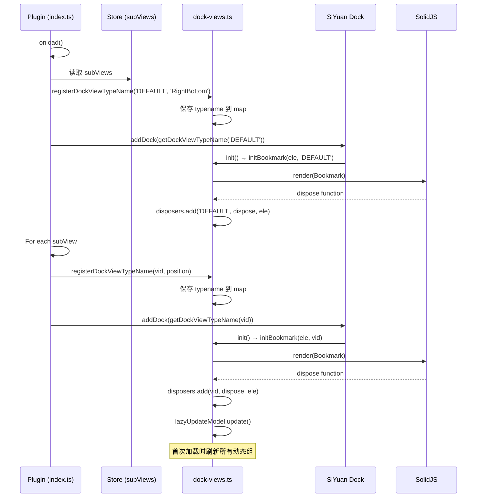
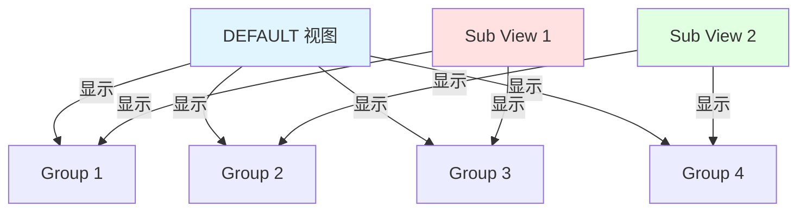
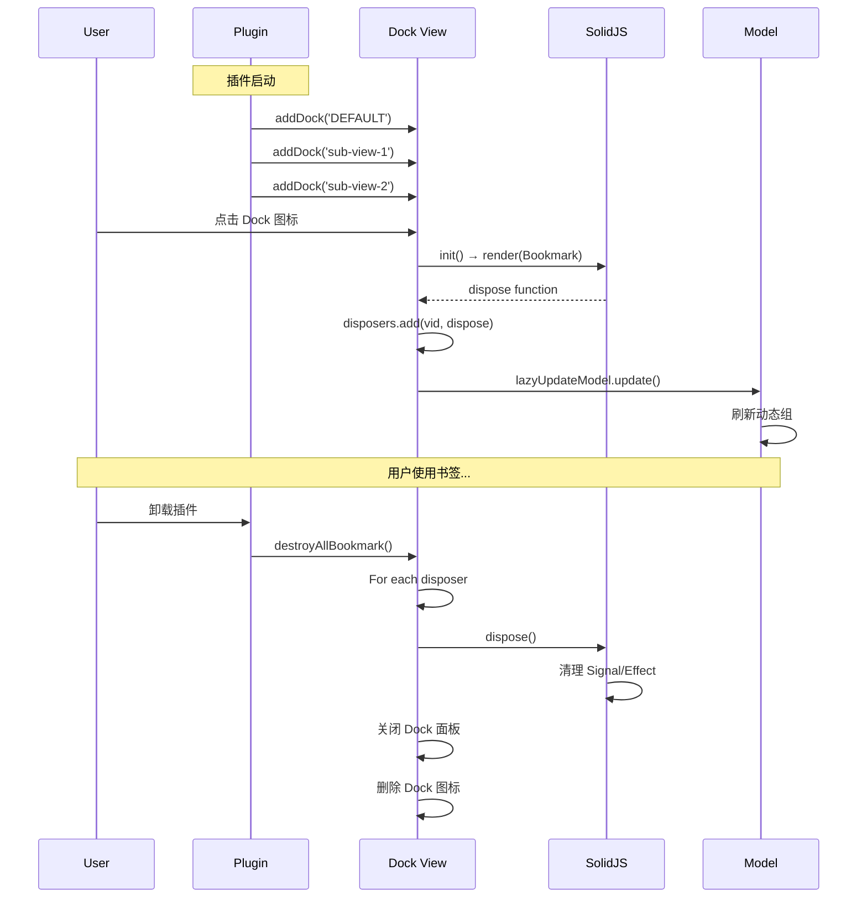

# Dock 视图系统

## 概述

sy-bookmark-plus 支持多视图模式，可以在思源的 Dock 侧栏中注册多个独立的书签视图。本文档描述 Dock 视图的注册机制、多视图管理、Disposer 模式以及视图生命周期管理。

**核心特点**：
- **默认视图（DEFAULT）**：插件自带的主书签视图
- **自定义子视图（Sub Views）**：用户可创建多个独立的书签视图
- **Disposer 模式**：管理 SolidJS 组件的生命周期，防止内存泄漏
- **懒加载更新**：视图首次渲染时自动刷新动态组

---

## Dock 视图类型

### 1. DEFAULT 视图

**定义**：插件内置的主书签视图

**特点**：
- 固定存在，无法删除
- 显示所有未隐藏的书签组
- 可以替换思源默认书签功能
- 快捷键：Alt+3（可配置）

**注册时机**：`index.ts` 的 `onload()` 阶段

```typescript
registerDockViewTypeName('DEFAULT', 'RightBottom');
this.addDock({
    type: getDockViewTypeName('DEFAULT'),
    config: {
        position: 'RightBottom',
        size: { width: 200, height: 200 },
        icon: 'iconBookmark',
        title: 'Bookmark+'
    },
    data: {
        plugin: this,
        initBookmark: initBookmark,
    },
    init() {
        this.data.initBookmark(this.element, 'DEFAULT');
    }
});
```

### 2. Sub Views（子视图）

**定义**：用户自定义的书签视图

**特点**：
- 用户可创建任意数量
- 每个视图包含指定的书签组
- 独立的展开/折叠状态
- 自定义名称和图标
- 可以隐藏（不注册到 Dock）

**注册时机**：遍历 `subViews()`，为每个未隐藏的视图注册 Dock

```typescript
for (let [vid, view] of Object.entries(subViews())) {
    if (view.hidden === true) continue;  // 跳过隐藏的视图

    let icon = view.icon?.type === 'symbol' ? view.icon.value : 'iconEmoji';
    const position = view.dockPosition ?? 'RightBottom';
    registerDockViewTypeName(vid as TBookmarkSubViewId, position);

    this.addDock({
        type: getDockViewTypeName(vid),
        config: {
            position: position,
            size: { width: 200, height: 200 },
            icon: icon,
            title: view.name || 'Bookmark+'
        },
        data: {
            plugin: this,
            initBookmark: initBookmark,
        },
        init() {
            this.data.initBookmark(this.element, vid);
        }
    });
}
```

---

## Dock 注册流程

### 注册时序图



### registerDockViewTypeName

**作用**：注册并生成唯一的 Dock 视图类型名（包含 position 信息）

```typescript
export const registerDockViewTypeName = (vid: TBookmarkSubViewId | 'DEFAULT', position: string): void => {
    const typeName = `::sub-view::${position}::${vid}`;
    dockViewTypeMap.set(vid, typeName);
}

// 示例
registerDockViewTypeName('DEFAULT', 'RightBottom');  // → 存储 '::sub-view::RightBottom::DEFAULT'
registerDockViewTypeName('my-custom-view', 'LeftTop'); // → 存储 '::sub-view::LeftTop::my-custom-view'
```

**调用时机**：在 `addDock()` 前调用，将 typename 存储到内部 map

### getDockViewTypeName

**作用**：获取已注册的 Dock 视图类型名

```typescript
export const getDockViewTypeName = (vid: TBookmarkSubViewId | 'DEFAULT'): string => {
    return dockViewTypeMap.get(vid) ?? `::sub-view::${vid}`;
}

// 示例
getDockViewTypeName('DEFAULT')        // → '::sub-view::RightBottom::DEFAULT'（已注册）
getDockViewTypeName('unknown-view')   // → '::sub-view::unknown-view'（降级方案）
```

**用途**：
- 思源通过 `type` 识别不同的 Dock 面板
- 插件内部通过 `type` 查找对应的 Dock 图标元素
- `dockViewIconElement()` 使用此函数来定位 DOM 元素

### dockViewIconElement

**作用**：获取 Dock 侧栏中的图标元素

```typescript
export const dockViewIconElement = (vid: TBookmarkSubViewId | 'DEFAULT') => {
    const plugin = thisPlugin();
    return document.querySelector(
        `span[data-type="${plugin.name}${getDockViewTypeName(vid)}"]`
    ) as HTMLElement;
}

// 示例
const icon = dockViewIconElement('DEFAULT');
icon?.click();  // 打开/关闭 Dock 面板
```

**用途**：
- 程序化打开/关闭 Dock 面板
- 处理快捷键绑定
- Disposer 销毁时关闭面板

---

## Disposer 模式

### 为何需要 Disposer？

**问题**：SolidJS 使用细粒度响应式，创建的 Signal、Effect 需要手动清理

**后果**：不清理会导致：
- **内存泄漏**：Effect 持续订阅 Signal，即使组件已卸载
- **性能下降**：废弃的 Effect 仍在运行
- **状态错乱**：已销毁的组件仍响应 Store 变化

**方案**：使用 Disposer 函数清理所有副作用

### Disposer 对象结构

**文件**：`src/dock-views.ts`

```typescript
export const disposers = {
    // 视图 ID → 对应的 DOM 元素
    _ele: {} as Record<TBookmarkSubViewId, HTMLElement>,

    // 视图 ID → 对应的 dispose 函数
    _disposer: {} as Record<TBookmarkSubViewId, (() => void)>,

    // 添加 disposer
    add: (vid, fn, element) => {...},

    // 销毁单个视图
    dispose: (vid, actions?) => {...},

    // 销毁所有视图
    disposeAll: () => {...}
};
```

### 添加 Disposer

```typescript
const initBookmark = async (ele: HTMLElement, sourceView: string) => {
    // 1. 渲染 SolidJS 组件
    const dispose = render(() => Bookmark({
        plugin: thisPlugin(),
        sourceView: sourceView ?? 'DEFAULT'
    }), ele);

    // 2. 注册 disposer
    disposers.add(sourceView ?? 'DEFAULT', dispose, ele);

    // 3. 懒加载更新
    lazyUpdateModel.update();
};
```

**render()** 返回值：
- 类型：`() => void`
- 作用：调用时清理所有 Signal、Effect、Event Listener

### 销毁 Disposer

```typescript
dispose: (vid: TBookmarkSubViewId, actions?: {
    hideIcon?: boolean;          // 隐藏图标（保留 DOM）
    deleteIcon?: boolean;        // 删除图标（移除 DOM）
    deleteDockElement?: boolean; // 删除整个 Dock 容器
}) => {
    // 1. 调用 dispose 函数（清理 SolidJS）
    if (disposers._disposer[vid]) {
        disposers._disposer[vid]();
        delete disposers._disposer[vid];
    }

    // 2. 处理 Dock 图标
    const iconBtn = dockViewIconElement(vid);
    if (iconBtn && iconBtn.classList.contains('dock__item--active')) {
        iconBtn.click();  // 关闭 Dock 面板

        if (actions?.hideIcon) {
            iconBtn.classList.add('fn__none');  // 隐藏图标
        }
        if (actions?.deleteIcon) {
            iconBtn.remove();  // 删除图标
        }
    }

    // 3. 删除 Dock 容器（可选）
    if (actions?.deleteDockElement && disposers._ele[vid]) {
        const ele = disposers._ele[vid];
        const container = ele?.closest('[data-type="wnd"]')?.closest('.fn__flex-1.fn__flex:not([data-type="wnd"])')
        container?.classList.toggle('fn__none', true);
        delete disposers._ele[vid];
    }
}
```

### 销毁所有视图

```typescript
export const destroyAllBookmark = () => {
    const viewIds = Object.keys(disposers._disposer);
    for (let vid of viewIds) {
        destroyBookmark(vid as TBookmarkGroupId);
    }
}

// 插件卸载时调用
onunload() {
    destroyAllBookmark();
    // ...
}
```

---

## 多视图协调机制

### 视图与书签组的关系



**规则**：
- **DEFAULT 视图**：显示所有 `group.hidden !== true` 的书签组
- **Sub Views**：显示 `view.groups` 数组中指定的书签组
- **同一书签组**可以在多个视图中显示
- **展开状态**：Sub View 有独立的 `view.expand` 配置，优先于 `group.expand`

### 视图过滤逻辑

**文件**：`src/components/bookmark.tsx`

```tsx
const shownGroups = createMemo(() => {
    if (props.sourceView === "DEFAULT") {
        // DEFAULT 视图：显示所有未隐藏的组
        return groups.filter(group => !group.hidden);
    } else {
        // Sub View：显示配置中指定的组
        const view = subViews()[props.sourceView];
        if (!view) return [];

        let ans = [];
        for (const gid of view.groups) {
            const g = groups.find(g => g.id === gid);
            if (g) ans.push(g);
        }
        return ans;
    }
});
```

### 展开状态优先级

**文件**：`src/components/group.tsx`

```typescript
const isOpen = createMemo(() => {
    // 1. 优先使用 Sub View 的配置
    if (context.subViewId !== 'DEFAULT') {
        const view = subViews()[context.subViewId];
        let expand = view?.expand[props.group.id];
        if (expand !== undefined) {
            return !expand;  // 注意：expand=true 表示折叠
        }
    }

    // 2. 使用书签组自己的配置
    let index = groups.findIndex((g) => g.id === props.group.id);
    let group = groups[index];
    return group.expand !== undefined ? !group.expand : true;
});
```

### 保存展开状态

```typescript
const toggleOpen = (open?: boolean) => {
    let expand = !(open !== undefined ? open : !isOpen());

    if (context.subViewId === 'DEFAULT') {
        // DEFAULT 视图：保存到 group.expand
        setGroups((g) => g.id === props.group.id, 'expand', expand);
    } else {
        // Sub View：保存到 view.expand
        if (subViews()[context.subViewId].expand === undefined) {
            subViews.update(context.subViewId, 'expand', {});
        }
        subViews.update(context.subViewId, 'expand', props.group.id, expand);
    }

    model.save();
};
```

---

## 懒加载更新机制

### lazyUpdateModel

**作用**：视图首次渲染时，自动刷新所有动态组

```typescript
const lazyUpdateModel = {
    _hasUpdate: false,  // 标记是否已更新

    update: async () => {
        if (lazyUpdateModel._hasUpdate === false) {
            lazyUpdateModel._hasUpdate = true;
            const model = getModel();
            await model.updateViews();  // 刷新所有动态组
        }
    }
}
```

**为何需要懒加载？**
- **性能优化**：插件加载时不立即刷新，等待 Dock 面板打开后再刷新
- **避免重复**：多个视图同时渲染时，只刷新一次
- **用户体验**：Dock 打开后立即看到最新数据

**调用时机**：`initBookmark()` 结束时

```typescript
const initBookmark = async (ele: HTMLElement, sourceView: string) => {
    // 1. 渲染组件
    const dispose = render(() => Bookmark(...), ele);

    // 2. 注册 disposer
    disposers.add(sourceView, dispose, ele);

    // 3. 懒加载更新（首次渲染时执行）
    lazyUpdateModel.update();  // ← 这里
};
```

---

## 视图生命周期

### 完整生命周期



### 生命周期钩子

| 阶段 | 触发时机 | 操作 |
|------|---------|------|
| **注册** | `Plugin.onload()` | `addDock()` 注册所有视图 |
| **初始化** | 用户首次打开 Dock | `render()` 渲染组件 |
| **激活** | 每次打开 Dock | 无（组件已渲染） |
| **懒加载** | 首次渲染后 | `lazyUpdateModel.update()` |
| **销毁** | 插件卸载或视图删除 | `dispose()` 清理资源 |

---

## 动态创建/销毁视图

### 创建新视图

**场景**：用户在设置中创建新的 Sub View

```typescript
// 1. 添加到 subViews Store
subViews.update(newViewId, {
    id: newViewId,
    name: 'My View',
    groups: [],
    expand: {},
    hidden: false,
    dockPosition: 'RightBottom'
});

// 2. 重启思源后自动注册为 Dock
// （插件 onload 时会遍历 subViews）
```

**注意**：视图需要重启思源才能注册到 Dock

### 删除视图

**场景**：用户在设置中删除 Sub View

```typescript
// 1. 从 subViews 中删除
const updated = {...subViews.unwrap()};
delete updated[viewId];
subViews.update(updated);

// 2. 销毁 Disposer（如果视图已渲染）
if (disposers._disposer[viewId]) {
    destroyBookmark(viewId, {
        deleteIcon: true,        // 删除图标
        deleteDockElement: true  // 删除容器
    });
}

// 3. 保存配置
await saveSubViews();
```

---

## 移动端适配

### 移动端特殊处理

```typescript
const initBookmark = async (ele: HTMLElement, sourceView: string) => {
    ele.classList.add('fn__flex-column');

    if (isMobile()) {
        // 隐藏默认的空列表提示
        // 参考：https://github.com/frostime/sy-bookmark-plus/issues/13#issuecomment-2283031563
        let empty = ele.querySelector('.b3-list--empty') as HTMLElement;
        if (empty) empty.style.display = 'none';
    }

    // ...
};
```

**问题**：移动端思源会自动添加 `.b3-list--empty` 元素

**方案**：手动隐藏该元素，使用插件自己的 UI

---

## 最佳实践

### 1. 视图命名

**规则**：使用描述性名称，避免特殊字符

```typescript
// ✅ 好
newView.name = "工作笔记";
newView.name = "Daily Notes";

// ❌ 不好
newView.name = "::view::1";  // 与内部命名冲突
newView.name = "视图#1";     // 特殊字符可能导致问题
```

### 2. Disposer 管理

**规则**：所有 render() 必须注册 disposer

```typescript
// ✅ 好
const dispose = render(() => <App />, element);
disposers.add(viewId, dispose, element);

// ❌ 不好
render(() => <App />, element);  // 没有保存 dispose 函数
```

### 3. 视图隔离

**规则**：不同视图使用独立的 `sourceView` ID

```typescript
// ✅ 好 - 每个视图有独立 ID
initBookmark(ele, 'DEFAULT');
initBookmark(ele, 'work-notes');
initBookmark(ele, 'daily-notes');

// ❌ 不好 - 复用 ID
initBookmark(ele, 'DEFAULT');
initBookmark(ele, 'DEFAULT');  // 冲突！
```

### 4. 懒加载优化

**规则**：避免插件启动时立即刷新所有视图

```typescript
// ✅ 好 - 使用 lazyUpdateModel
lazyUpdateModel.update();  // 只在首次渲染时刷新

// ❌ 不好 - 立即刷新
model.updateViews();  // 插件启动时就刷新，性能差
```

---

## 常见问题

### Q1: 为何重启后 Sub View 消失？

**原因**：Sub View 的 `hidden` 字段为 `true`

**解决**：在设置中取消隐藏

### Q2: 如何程序化打开 Dock 面板？

```typescript
const icon = dockViewIconElement('DEFAULT');
icon?.click();
```

### Q3: Disposer 何时调用？

- 插件卸载时（`onunload`）
- 用户删除 Sub View 时
- 视图需要重新渲染时（先 dispose 再 render）

### Q4: 同一书签组在多个视图中展开状态如何同步？

**不同步**：每个视图有独立的展开状态

- DEFAULT 视图：使用 `group.expand`
- Sub Views：使用 `view.expand[groupId]`

---

## 相关文档

- [整体架构](./architecture.md) - 插件生命周期和模块关系
- [SolidJS 组件系统](./solidjs-components.md) - 组件渲染和 Context 传递
- [数据模型与存储](./data-model.md) - subViews Store 管理
