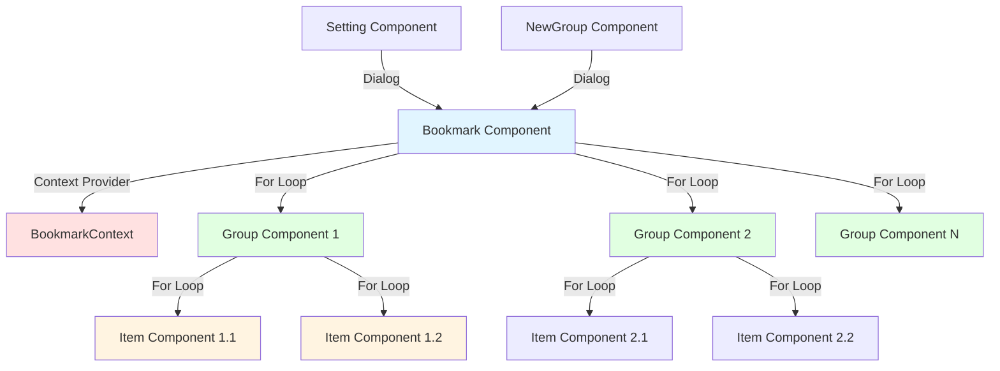
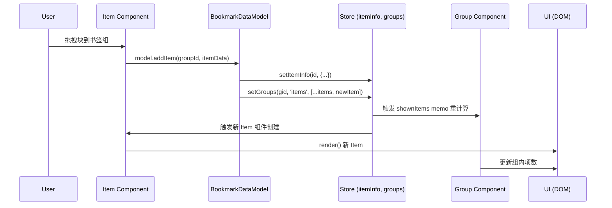
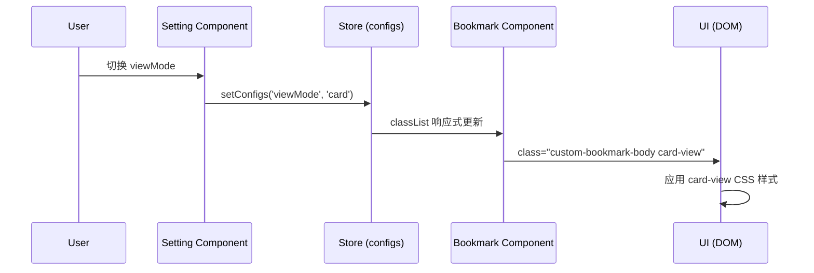
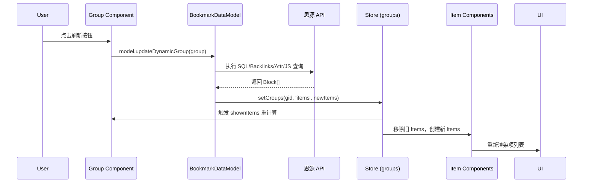

# SolidJS 组件系统

## 概述

sy-bookmark-plus 使用 **SolidJS** 作为前端框架，通过细粒度的响应式系统实现高性能的 UI 更新。项目采用 **solid-js/store** 进行全局状态管理，并集成了作者自研的 **@frostime/solid-signal-ref** 库简化 Store 操作。

**核心特点**：
- **细粒度响应式**：只更新变化的 DOM 节点，无虚拟 DOM 开销
- **全局 Store**：集中管理书签数据、配置、视图状态
- **Context 传递**：通过 `BookmarkContext` 共享插件实例和 Model
- **类型安全**：完整的 TypeScript 支持

---

## 组件层级关系

### 组件树结构



### 组件职责

| 组件 | 文件 | 职责 |
|------|------|------|
| **Bookmark** | `bookmark.tsx` | 根组件，提供 Context，渲染顶栏和组列表 |
| **Group** | `group.tsx` | 书签组，管理展开/折叠，渲染组标题和项列表 |
| **Item** | `item.tsx` | 书签项，处理点击、拖拽、右键菜单 |
| **Setting** | `setting/index.tsx` | 设置面板，管理全局配置和书签组 |
| **NewGroup** | `new-group.tsx` | 创建新书签组对话框 |
| **GroupIcon** | `elements/group-icon.tsx` | 书签组图标组件 |
| **SelectIcon** | `elements/select-icon.tsx` | 图标选择器 |

---

## BookmarkContext 系统

### Context 定义

**文件**：`src/components/context.ts`

```typescript
interface IBookmarkContext {
    plugin: Plugin;                      // 插件实例
    model: BookmarkDataModel;            // 数据模型
    shownGroups: Accessor<IBookmarkGroup[]>;  // 当前显示的书签组
    doAction: Accessor<string>;          // 全局操作信号（展开/折叠全部）
    subViewId: TBookmarkSubViewId | 'DEFAULT';  // 当前视图 ID
}

export const BookmarkContext = createContext<IBookmarkContext>();
```

### Context 提供者

**文件**：`src/components/bookmark.tsx`

```tsx
<BookmarkContext.Provider
    value={{
        plugin: props.plugin,
        model: model,
        subViewId: props.sourceView,
        shownGroups,
        doAction
    }}
>
    <Bookmark />
</BookmarkContext.Provider>
```

### Context 消费

子组件通过 `useContext` 获取 Context：

```typescript
const { plugin, model, shownGroups } = useContext(BookmarkContext);
```

**使用场景**：
- **Group 组件**：获取 `model` 执行数据操作
- **Item 组件**：获取 `plugin` 打开文档，获取 `model` 更新数据
- **所有组件**：共享同一个 `model` 实例，避免 props 层层传递

---

## Signal 和 Store 数据流

### 全局 Store

**文件**：`src/model/stores.ts`

```typescript
// 1. 书签项信息（引用计数、错误状态）
export const [itemInfo, setItemInfo] = createStore<{
    [key: BlockId]: IBookmarkItemInfo
}>({});

// 2. 书签组列表
export const [groups, setGroups] = createStore<IBookmarkGroup[]>([]);

// 3. 子视图配置
export const subViews = createStoreRef<{
    [key: TBookmarkSubViewId]: IBookmarkSubView
}>({});

// 4. 插件配置
export const [configs, setConfigs] = createStore<IConfig>({
    hideClosed: true,
    hideDeleted: true,
    viewMode: 'bookmark',
    replaceDefault: true,
    // ...
});
```

### Store 特点

- **细粒度更新**：只订阅使用的属性，变化时精确更新
- **嵌套响应式**：`groups[0].items[2].style` 的变化只触发对应 Item 重渲染
- **只读访问**：组件直接读取 Store（如 `groups`、`itemInfo[id]`）
- **写入隔离**：只能通过 `setGroups`、`setItemInfo` 修改

### 组件中的 Signal

**局部状态**：使用 `createSignal` 管理组件内部状态

```typescript
// bookmark.tsx
const [fnRotate, setFnRotate] = createSignal("");  // 刷新图标旋转动画
const [doAction, setDoAction] = createSignal<TAction>("");  // 全局操作指令

// group.tsx
const [isDragOver, setIsDragOver] = createSignal(false);  // 拖拽悬停状态

// item.tsx
const [NodeType, setNodeType] = createSignal<string>("");
const [Icon, setIcon] = createSignal<string>("");
```

**Memo 计算属性**：使用 `createMemo` 缓存计算结果

```typescript
// bookmark.tsx - 根据 sourceView 过滤显示的书签组
const shownGroups = createMemo(() => {
    if (props.sourceView === "DEFAULT") {
        return groups.filter(group => !group.hidden);
    } else {
        const view = subViews()[props.sourceView];
        let ans = [];
        for (const gid of view.groups) {
            const g = groups.find(g => g.id === gid);
            if (g) ans.push(g);
        }
        return ans;
    }
});

// group.tsx - 过滤隐藏的书签项
let shownItems = createMemo(() => {
    let index = groups.findIndex((g) => g.id === props.group.id);
    let group = groups[index];
    let items = group.items.slice();
    if (configs.hideClosed) {
        items = items.filter((it) => itemInfo[it.id]?.err !== 'BoxClosed');
    }
    if (configs.hideDeleted) {
        items = items.filter((it) => itemInfo[it.id]?.err !== 'BlockDeleted');
    }
    return items;
});
```

---

## solidjs-signal-ref 集成

### 库简介

**@frostime/solid-signal-ref** 是作者自研的库，用于简化 SolidJS Store 的操作：

- `createStoreRef<T>()` - 创建带便捷方法的 Store
- `.unwrap()` - 获取非响应式副本
- `.update()` - 批量更新或嵌套更新

### 使用示例

**文件**：`src/model/stores.ts`

```typescript
import { createStoreRef, wrapStoreRef } from "@frostime/solid-signal-ref";

// 1. 创建 StoreRef
export const subViews = createStoreRef<{
    [key: TBookmarkSubViewId]: IBookmarkSubView
}>({});

// 2. 使用 .update() 方法
subViews.update(viewId, 'groups', (gs: IBookmarkGroup['id'][]) => {
    return [...gs, newGroup.id];
});

subViews.update(viewId, 'expand', groupId, true);

// 3. 使用 .unwrap() 获取纯 JS 对象
const data = subViews.unwrap();  // 用于保存到文件
await plugin.saveData('sub-views.json', data);

// 4. 批量更新
subViews.update({
    [viewId]: {
        name: 'New Name',
        groups: [...]
    }
});
```

**包装现有 Store**：

```typescript
export const [configs, setConfigs] = createStore<IConfig>({...});

// 包装为 StoreRef
export const configRef = wrapStoreRef(configs, setConfigs);

// 现在可以使用 .unwrap() 和 .update()
configRef.unwrap();
```

### 为何使用 solidjs-signal-ref？

- **类型推导**：TypeScript 友好，自动推导嵌套路径类型
- **简化代码**：避免复杂的 `setStore((prev) => ({...prev, ...}))` 写法
- **统一接口**：`.update()` 支持多种更新模式（路径、函数、对象）

---

## 组件间通信模式

### 1. Props 传递（父 → 子）

**单向数据流**：父组件通过 props 传递数据和回调

```tsx
// bookmark.tsx → group.tsx
<Group
    group={group}
    groupDelete={groupDelete}
    groupMove={groupMove}
/>

// group.tsx → item.tsx
<Item
    group={props.group.id}
    itemCore={item}
    deleteItem={deleteItem}
/>
```

### 2. Context 共享（跨层级）

**避免 props drilling**：通过 Context 共享全局数据

```typescript
// bookmark.tsx - 提供
<BookmarkContext.Provider value={{plugin, model, ...}}>
    ...
</BookmarkContext.Provider>

// item.tsx - 消费
const { plugin, model } = useContext(BookmarkContext);
```

### 3. Store 响应式（全局状态）

**自动订阅更新**：组件直接读取 Store，变化时自动重渲染

```tsx
// item.tsx - 自动订阅 itemInfo[id]
const item = () => itemInfo[props.itemCore.id];

createEffect(() => {
    let value = item();  // 当 itemInfo[id] 变化时，此 Effect 自动运行
    // ...更新 UI
});
```

### 4. Signal 通信（兄弟组件）

**共享 Signal**：顶层定义 Signal，多个组件共享

```typescript
// context.ts - 定义共享 Signal
export const [groupDrop, setGroupDrop] = createSignal<TBookmarkGroupId>("");
export const [itemMoving, setItemMoving] = createSignal<IMoveItemDetail>({...});

// item.tsx - 设置
setItemMoving({
    srcItem: item().id,
    srcGroup: props.group,
    targetGroup: targetGroup,
    afterItem: afterItem
});

// group.tsx - 读取
const dragovered = createMemo(() => {
    let value = itemMoving();
    if (value.targetGroup === props.group.id && value.afterItem === '') {
        return 'dragovered';
    }
    return '';
});
```

### 5. 全局操作信号（广播）

**doAction Signal**：Bookmark 组件发出全局指令，所有 Group 组件响应

```tsx
// bookmark.tsx - 发出指令
<span onClick={() => setDoAction('AllExpand')}>展开全部</span>
<span onClick={() => setDoAction('AllCollapse')}>折叠全部</span>

// group.tsx - 订阅指令
createEffect(() => {
    let action = doAction();
    if (action === "AllExpand") {
        toggleOpen(true);
    } else if (action === "AllCollapse") {
        toggleOpen(false);
    }
});
```

---

## 响应式数据流示例

### 场景：用户添加书签项



### 场景：用户切换视图模式（书签 ↔ 卡片）



### 场景：动态组刷新



---

## 性能优化策略

### 1. createMemo 缓存

**问题**：频繁计算导致性能损耗

**方案**：使用 `createMemo` 缓存计算结果，依赖变化时才重新计算

```typescript
// ❌ 不好 - 每次渲染都重新过滤
const shownItems = () => {
    return groups[index].items.filter(it => itemInfo[it.id]?.err !== 'BoxClosed');
}

// ✅ 好 - 只在 groups[index] 或 itemInfo 变化时重新计算
const shownItems = createMemo(() => {
    let items = groups[index].items;
    return items.filter(it => itemInfo[it.id]?.err !== 'BoxClosed');
});
```

### 2. 细粒度订阅

**问题**：订阅整个对象导致不必要的重渲染

**方案**：只订阅使用的属性

```typescript
// ❌ 不好 - item 任何属性变化都触发
const item = () => itemInfo[id];
<div>{JSON.stringify(item())}</div>

// ✅ 好 - 只订阅 title
<div>{itemInfo[id]?.title}</div>
```

### 3. Debounce 批量更新

**问题**：拖拽时频繁触发保存

**方案**：使用 debounce 延迟保存

```typescript
// model/stores.ts
export const saveGroupMap = debounce(_saveGroupMap, 1000);

// 频繁调用
model.save();  // 实际 1000ms 后才执行一次
```

### 4. 条件渲染

**问题**：渲染大量不可见元素

**方案**：使用 `<Show>` 和 `classList` 按需渲染

```tsx
// 只在需要时渲染
<Show when={isDynamicGroup()}>
    <RefreshButton />
</Show>

// 使用 CSS 隐藏而非条件渲染（保持 DOM 结构）
<div classList={{
    'card-view': configs.viewMode === 'card',
    'bookmark-view': configs.viewMode === 'bookmark'
}}>
```

---

## 最佳实践

### 1. Store 修改原则

**规则**：只在 Model 层修改 Store，组件层只读

```typescript
// ✅ 好 - 通过 Model 修改
const { model } = useContext(BookmarkContext);
model.setGroups(groupId, 'expand', true);

// ❌ 不好 - 在组件中直接修改
setGroups(g => g.id === groupId, 'expand', true);
```

### 2. Effect 清理

**规则**：有副作用的 Effect 需要清理

```typescript
createEffect(() => {
    const handler = () => {...};
    window.addEventListener('resize', handler);

    // 清理函数
    onCleanup(() => {
        window.removeEventListener('resize', handler);
    });
});
```

### 3. Memo vs Signal

**规则**：纯计算用 Memo，有副作用或需要手动触发用 Signal

```typescript
// ✅ Memo - 纯计算
const fullName = createMemo(() => firstName() + ' ' + lastName());

// ✅ Signal - 需要手动控制
const [loading, setLoading] = createSignal(false);
```

### 4. Context 粒度

**规则**：Context 传递稳定的值，避免频繁变化的 Signal

```typescript
// ✅ 好 - 传递稳定的实例
<Context.Provider value={{plugin, model}}>

// ❌ 不好 - 传递频繁变化的 Signal
<Context.Provider value={{count: count()}}>  // 每次 count 变化都重新提供 Context
```

---

## 常见模式

### 1. 列表渲染

```tsx
<For each={shownGroups()}>
    {(group) => <Group group={group} />}
</For>
```

### 2. 条件渲染

```tsx
<Show when={item().err} fallback={<NormalView />}>
    <ErrorView />
</Show>
```

### 3. 动画过渡

```tsx
<Transition name="slide-fade">
    <Show when={isOpen()}>
        <Content />
    </Show>
</Transition>
```

### 4. 表单绑定

```tsx
<input
    value={name()}
    onInput={(e) => setName(e.target.value)}
/>
```

---

## 相关文档

- [整体架构](./architecture.md) - 模块关系和数据流
- [数据模型与存储](./data-model.md) - Store 定义和持久化
- [Dock 视图系统](./dock-views.md) - Dock 注册和视图管理
