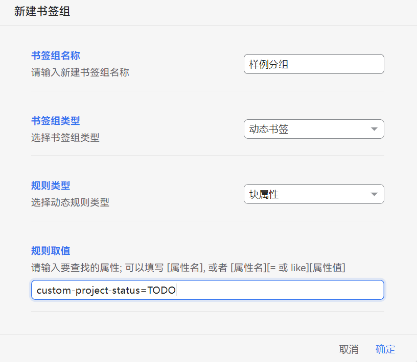
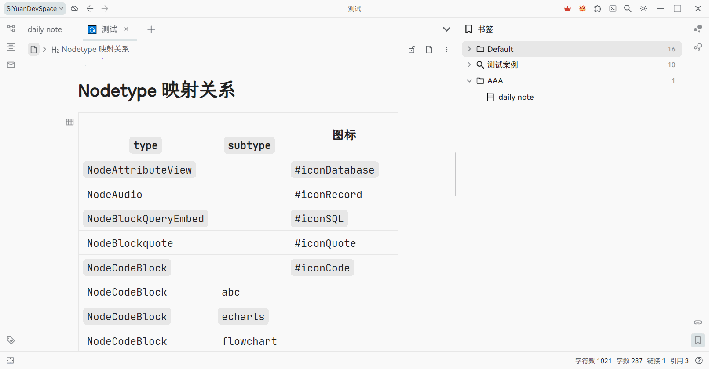
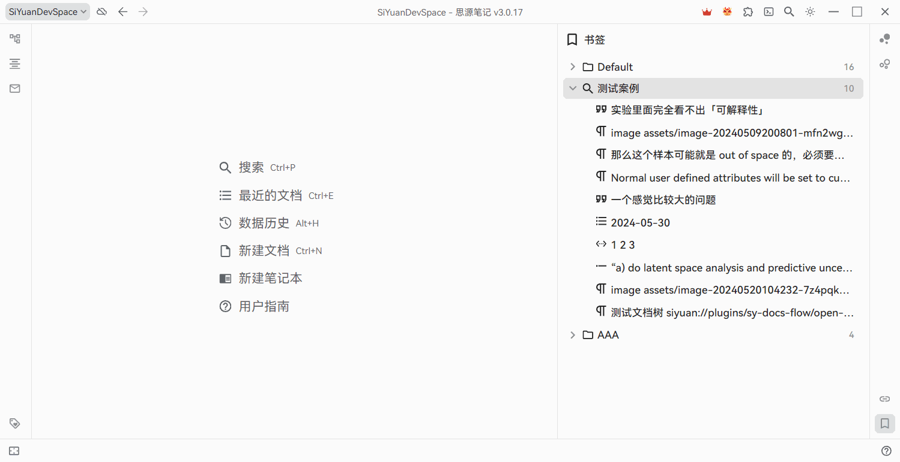
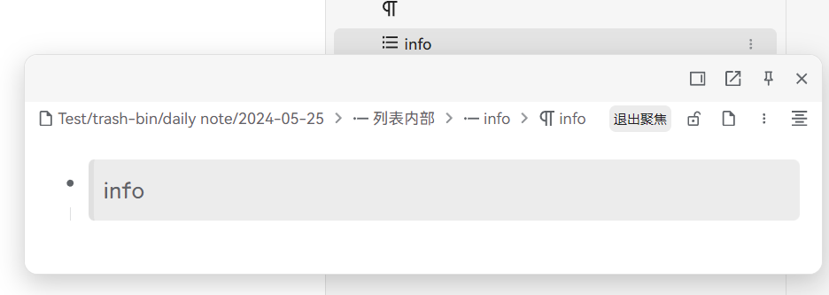
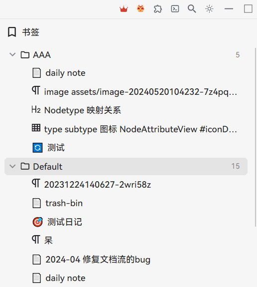
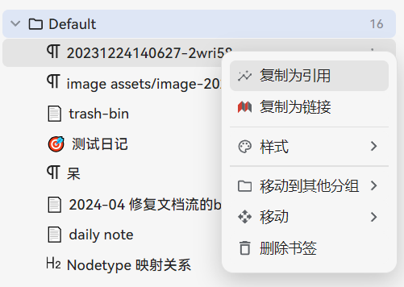
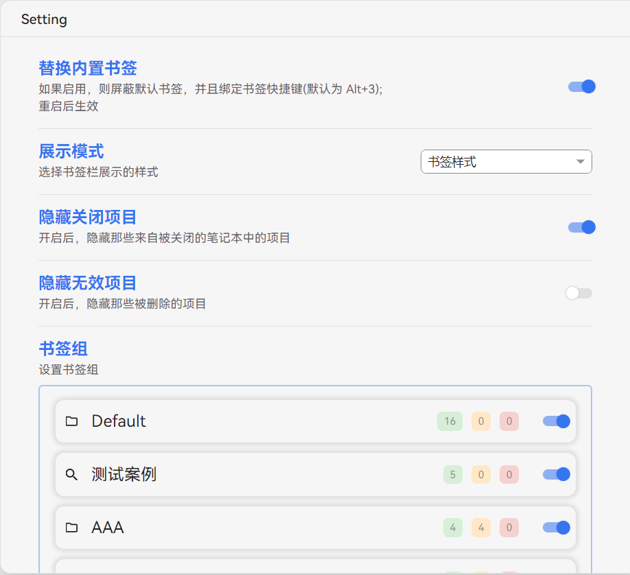
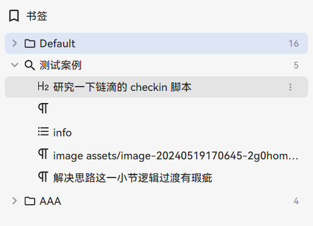
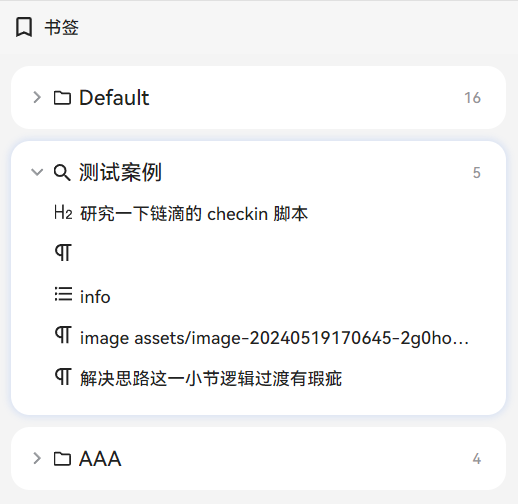

This plugin implements a more user-friendly bookmark feature, supporting drag-and-drop addition, bookmark group management, link copying, dynamic queries, and more.

> 🔔 Attention! By default, this plugin will hide the built-in bookmark button in the sidebar of SiYuan. You can disable this default behavior in the settings.

Below are the core functionalities. Please explore other detailed features on your own.

If you are satisfied with the plugin, welcome to visit our [Github page](https://github.com/frostime/sy-bookmark-plus) and star it!

## Bookmark Groups

Click "Add" on the top bar to create a new bookmark group. Bookmark groups are classified into two types:

* Static Bookmark Group: A regular bookmark group where users can manually add or remove bookmark items

  * Supports custom drag-and-drop functionality
  * Supports moving items within the bookmark group to different groups
* Dynamic Bookmark Group: A query-based dynamic bookmark group that lists query results; supports the following rules:

  * SQL Query: Input SQL query statements
  * Backlinks: Input block ID to query the backlinks of the corresponding block
  * Block Attribute: Query specified block attributes. You can input the block attributes you want to query, such as:

    1. `<Attribute>`, e.g., `custom-b`, returns all blocks containing the `custom-b` custom attribute
    2. `<Attribute>=<val>`, e.g., `bookmark=test`, returns all blocks within the "test" bookmark
    3. `<Attribute> like <val>`




## Adding Items

### Static Group

In a static bookmark group, you can add bookmark items through the following methods:

1. Editor Block Drag-and-Drop: In the editor, directly drag the block icon into the bookmark group
2. Right-click Menu of the Bookmark Group:

    1. Add from Clipboard: You can copy a block's ID, reference, or link, and the plugin will automatically recognize and add it to the bookmark group
    2. Add Current Document Block: Adds the currently edited document to the bookmark group



### Dynamic Group

Dynamic bookmark groups mainly acquire bookmark items by executing queries.

1. Global Update: Click the update button on the top bar to update all bookmark groups
2. Right-click Menu: Click the right-click menu of the dynamic group to re-execute the query in the current group and obtain the latest bookmark items



## Bookmark Items

* Click an item to navigate to the corresponding block
* Hover over the block icon to preview the block's content

  

* Drag the item and move to other group

  

* More features are available in the right-click menu~

  


## Plugin Settings



* Replace Built-in Bookmarks: If enabled, the plugin will automatically block the default SiYuan bookmarks at startup and override the bookmark shortcuts (default is Alt + 3)
* Display Styles: The plugin provides two styles (views)

  * Bookmark View: Same as the built-in bookmarks of SiYuan

    
  * Card View: Each bookmark group is presented in a card style

    
* Hide Items: Bookmark items may not be indexed due to being deleted or the notebook containing the block being closed

  * Hide Closed Items: When enabled, hide items from closed notebooks
  * Hide Invalid Items: When enabled, hide deleted items
* Bookmark Groups

  * Displays all bookmark groups
  * Adjust the order of bookmark groups by dragging with the mouse
  * You can hide temporarily unnecessary bookmark groups by deselecting their display

## Styling

Each component within the plugin has a specific `class` name. If customization is needed (e.g., modifying fonts), you can write your own CSS styles and place them in SiYuan's "Code Snippets".

* Top-level: `.custom-bookmark-body`

  * Card mode: `.custom-bookmark-body.card-view`
  * Background color in card mode is based on two CSS variables:

    * Base background color: `--fmisc-bookmark-body-bg__card-view`, default is `var(--b3-theme-surface-light)`
    * Card background color: `--fmisc-bookmark-group-bg__card-view`, default is `var(--b3-theme-background)`
* Each bookmark group: `.custom-bookmark-group`

  * Bookmark group header: `.custom-bookmark-group-header`
  * Bookmark list: `.custom-bookmark-group-list`
* Each bookmark item: `.custom-bookmark-item`

Example:

* Modify the font of bookmark items

  ```css
  .custom-bookmark-item.b3-list-item {
    font-size: 20px;
    line-height: 24px;
  }
  ```
* Modify the card background color:

  ```css
  :root {
      --fmisc-bookmark-body-bg__card-view: white;
      --fmisc-bookmark-group-bg__card-view: grey;
  }
  ```

## Q&A

### Is there a way to import items from the built-in bookmarks of SiYuan?

* Create a new bookmark group
* Select Dynamic Group and Attribute Rule
* Fill in `bookmark` or `bookmark=<bookmark name>` in the attribute rule


### Can I modify the display title of bookmark items?

* Simply add block `name` attribute to blocks.
* When bookmark items are displayed, if a `name` is available, it will be displayed first. Otherwise, the `content` of the block will be displayed.


### What does the "Refresh" button in the top bar do?

* For dynamic groups, it re-executes the query and displays the most recent query results.
* For static groups, it checks the current status of each item (block) and updates them based on the latest results.
