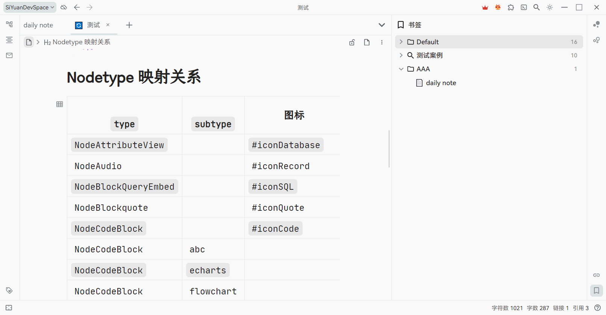
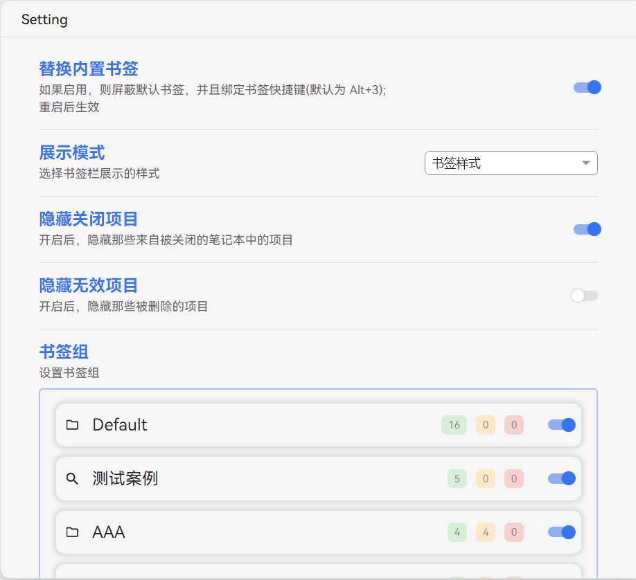
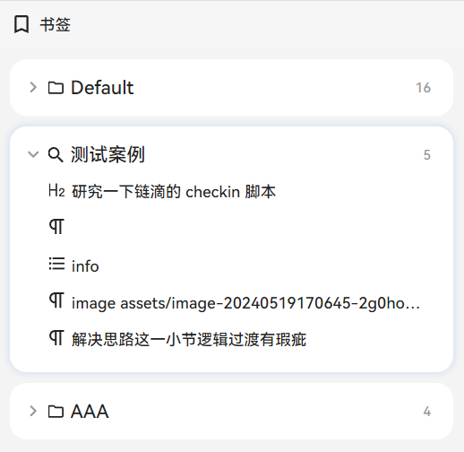

本插件实现了一个更加用户友好的书签功能。支持拖放添加、书签组管理、复制链接、动态查询等功能。

> 🔔 注意！本插件默认会屏蔽侧边栏当中思源的内置书签按钮！你可以在设置当中禁用这一默认行为。

以下介绍最核心的功能，其他细节功能请自行探索。

> - 如果图片无法显示，可以访问 [线上文档](https://flowus.cn/share/d84d5d98-cc4c-471b-ba2b-62338bb88511?code=80RAFK) 查看
> - 如果您对本项目还满意，欢迎来[Github主页](https://github.com/frostime/sy-bookmark-plus)为项目点 star

📝 更新日志见: [CHANGELOG.md](./CHANGELOG.md)

## 书签组

在顶栏中点击「添加」，可以新建一个书签组，书签组分类两种类型：

* 静态书签组：普通的书签组，由用户手动增加、减少书签项目

  * 支持自定义拖放功能
  * 支持将书签组内项目移动到不同组内
* 动态书签组：基于查询的动态书签组，将查询结果列举在侧栏中；支持以下规则

  * SQL 查询：输入 sql 查询语句
  * 反向链接：输入块 ID，查询对应块的反链
  * 块属性：查询指定块属性，输入需要查询的块属性，可以是：

    1. `<属性名>`，例如 `custom-b` ，返回所有含有 `custom-b` 自定义属性的块
    2. `<属性名>=<val>`，例如 `bookmark=测试`，返回所有「测试」书签内的块
    3. `<属性名> like <val>`


## 添加项目

### 静态组

在静态书签组当中，你可以通过这几种方法添加书签项目：

1. 编辑器块拖放：在编辑器中，直接将块的图标拖入书签组内
2. 书签组右键菜单中添加：

    1. 从剪贴板中添加：你可以复制一个块的 ID、引用、链接，插件会自动识别并将其添加到书签组中
    2. 添加当前文档块：会将当前正在编辑的文档添加到书签组中



### 动态组

动态书签组主要通过执行查询来获取书签项目。

1. 全局更新：点击顶栏的更新按钮，更新所有的书签组
2. 右键菜单：点击动态组右键菜单，重新在当前组中执行查询，并获取最新的书签项目


## 书签项目

* 点击项目，跳转对应的块
* 悬浮在块标上，可以预览块的内容

  

* 拖放调整书签位置

  

* 右键菜单中支持更多功能~

  


## 插件设置




* 替换内置书签：如果开启，在插件在启动的时候会自动屏蔽默认的思源书签，并且覆盖书签的快捷键（默认为 Alt + 3）
* 展示样式：插件提供了两种样式

  * 书签样式：和思源内置的书签一致

    

  * 卡片样式：各个书签组以卡片的样式呈现

    

* 隐藏项目：书签项目可能由于被删除、或者块所在的笔记本被关闭而无法被索引到

  * 隐藏关闭项目：开启后，隐藏那些来自被关闭的笔记本中的项目
  * 隐藏无效项目：开启后，隐藏那些被删除的项目
* 书签组

  * 展示了所有的书签组
  * 鼠标拖放可以调整各个书签组的先后顺序
  * 可以通过取消显示，来隐藏一些暂时不需要的书签组

## Styling

插件当中的每个组件部分都有特定的 `class` 名称，如果有自定义需求（例如修改字体）可以自行编写 css 样式并放入思源的「代码片段」中。

* 顶层：`.custom-bookmark-body`

  * 卡片模式：`.custom-bookmark-body.card-view`
  * 卡片模式下的背景颜色基于两个 css 变量：

    * 底层背景颜色：`--fmisc-bookmark-body-bg__card-view`，默认为 `var(--b3-theme-surface-light)`
    * 卡片背景颜色：`--fmisc-bookmark-group-bg__card-view`，默认为 `var(--b3-theme-background)`
* 各个书签组：`.custom-bookmark-group`

  * 书签组的标头：`.custom-bookmark-group-header`
  * 书签列表：`.custom-bookmark-group-list`
* 各个书签项目：`.custom-bookmark-item`

案例：

* 修改书签项目的字体

  ```css
  .custom-bookmark-item.b3-list-item {
    font-size: 20px;
    line-height: 24px;
  }
  ```
* 修改卡片背景颜色：

  ```css
  :root {
      --fmisc-bookmark-body-bg__card-view: white;
      --fmisc-bookmark-group-bg__card-view: grey;
  }
  ```

## Q&A

### 有没有办法把思源内置书签当中的项目导入进来？

* 新建书签组
* 选择动态组、属性规则
* 属性规则中填写 `bookmark`，或者 `bookmark=<书签名称>`

### 能不能修改书签项目的显示内容？

* 可以给块添加块命名
* 书签项目在显示的时候，如果有命名（name）会优先显示命名，否则就显示块的内容（content）

### 顶栏的「刷新」按钮是在刷新什么？

* 对于动态组，会重新执行查询，并显示最新的查询结果
* 对于静态组，会查询当中每个项目（块）的最新情况，并根据最新结果更新项目
